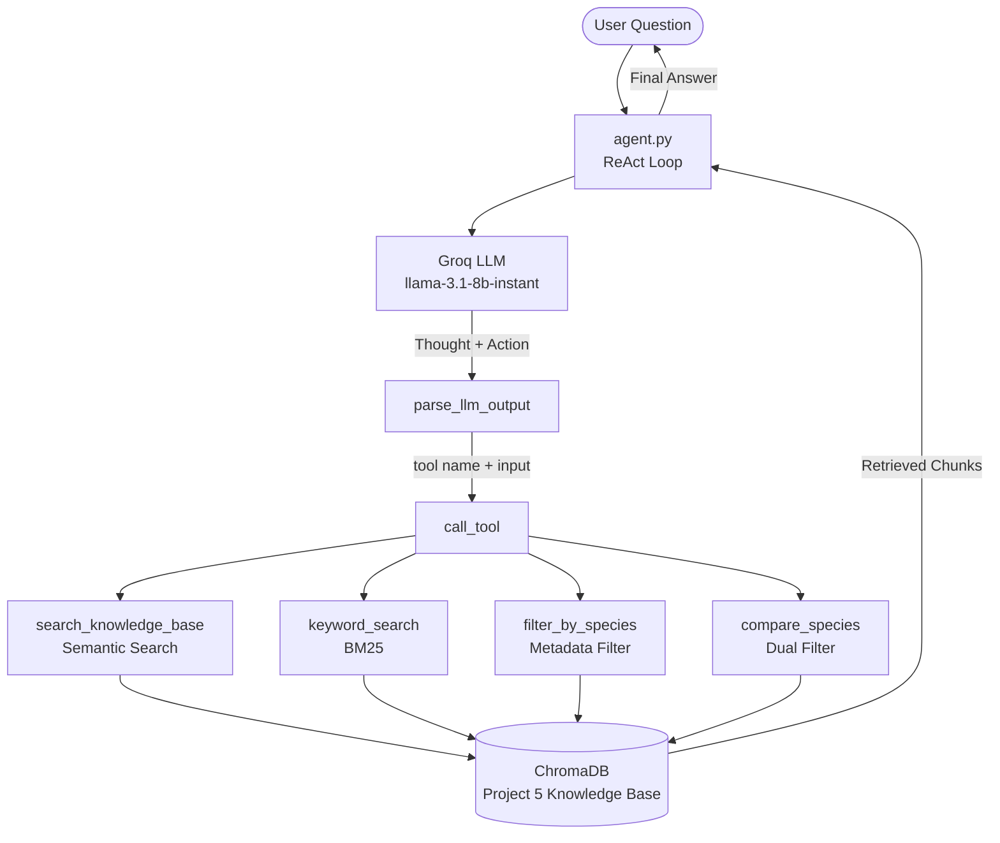
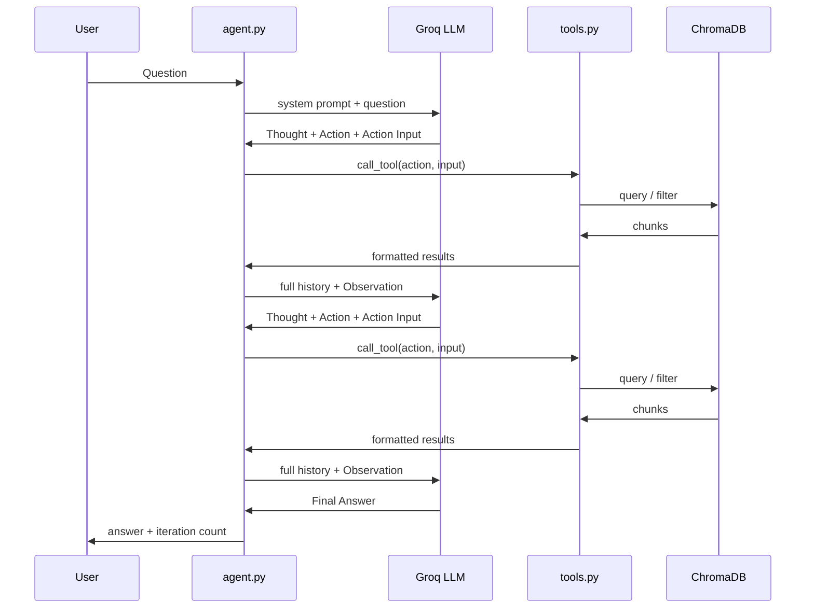
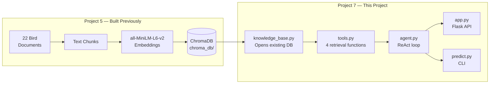

# Architecture: Project 7 — Agentic RAG

## System Overview

Project 7 is a ReAct-style agentic RAG system. It combines a domain-specific vector knowledge base (built in Project 5) with a reasoning loop that decides how to search, evaluates what it retrieved, and keeps searching until it can fully answer the question.

---

## High-Level Architecture



---

## Reasoning Loop Detail



---

## Component Breakdown

### config.py
Central settings file. Every other script imports constants from here — paths, model names, agent parameters, Flask port. Nothing is hardcoded in the scripts themselves.

### knowledge_base.py
Opens the existing ChromaDB database built in Project 5. Runs once at startup and keeps the connection open for the entire session. Returns the collection object and the loaded embedding model. Also provides `get_collection_stats()` for the health endpoint.

### tools.py
Defines four retrieval functions and their plain-English schemas. The schemas are injected into the system prompt so the LLM knows what each tool does and when to use it. The `TOOL_REGISTRY` dictionary maps tool name strings to actual Python functions. `call_tool()` dispatches any tool call the agent makes.

```
TOOL_SCHEMAS          → injected into system prompt for LLM to read
TOOL_REGISTRY         → maps string names to Python functions
call_tool()           → routes LLM tool calls to the right function
_format_results()     → normalizes ChromaDB output into clean dicts
```

### agent.py
The core of the project. Contains three main components:

```
build_system_prompt()    → constructs the instruction text sent to Groq on every call
parse_llm_output()       → extracts Thought, Action, Action Input, or Final Answer from raw text
run_agent()              → the while loop that drives the full reasoning cycle
```

The `run_agent()` loop:
1. Sends full conversation history to Groq
2. Parses the response — tool call or Final Answer
3. If tool call — runs the tool, appends result to history, loops again
4. If Final Answer — returns the answer and stops
5. If max iterations reached — returns a graceful fallback message

### evaluate.py
Benchmarks the agent against single-pass RAG on 6 multi-hop questions. For each question it runs single-pass RAG first, then the full agent, and prints both answers side by side. Outputs a summary showing iteration counts per question.

### predict.py
CLI interface. Loads the knowledge base once, then accepts questions in a loop. Supports a verbose toggle to show or hide per-iteration reasoning output. Useful for development testing without starting the Flask server.

### app.py
Flask API on port 5004. Four endpoints:

| Endpoint | Method | What It Does |
|---|---|---|
| `/health` | GET | Server status and knowledge base stats |
| `/ask` | POST | Runs the agent on a question, returns answer + metadata |
| `/species` | GET | Lists all species in the knowledge base |
| `/compare` | POST | Constructs a comparison question and runs the agent |

---

## Data Flow



---

## Key Design Decisions

**Reusing Project 5's ChromaDB** — The knowledge base was already built, chunked, and embedded. Project 7 opens it directly rather than rebuilding it. This keeps the project focused on the agentic layer rather than data preparation.

**Tool schemas in the prompt** — Each tool is described to the LLM in plain English inside the system prompt. The LLM reads these descriptions and decides which tool fits the question. This is how the agent knows what tools exist without any special framework.

**Conversation history as agent memory** — The agent has no memory beyond the current session. Everything it knows about its prior searches is carried in the `messages` list that grows with each iteration. Trimming this list after 8 messages prevents token overflow on Groq's free tier.

**Forced Final Answer at iteration 4** — After 4 searches the agent receives an explicit instruction to commit to a Final Answer. This prevents infinite loops on questions the knowledge base cannot fully answer, at the cost of occasionally cutting off a search that might have found something useful.

**Groq free tier constraints** — The 6,000 token per minute limit shapes several decisions: chunk trimming to 200 characters in tool results, 15 second sleeps between iterations, and history trimming to keep individual requests small.